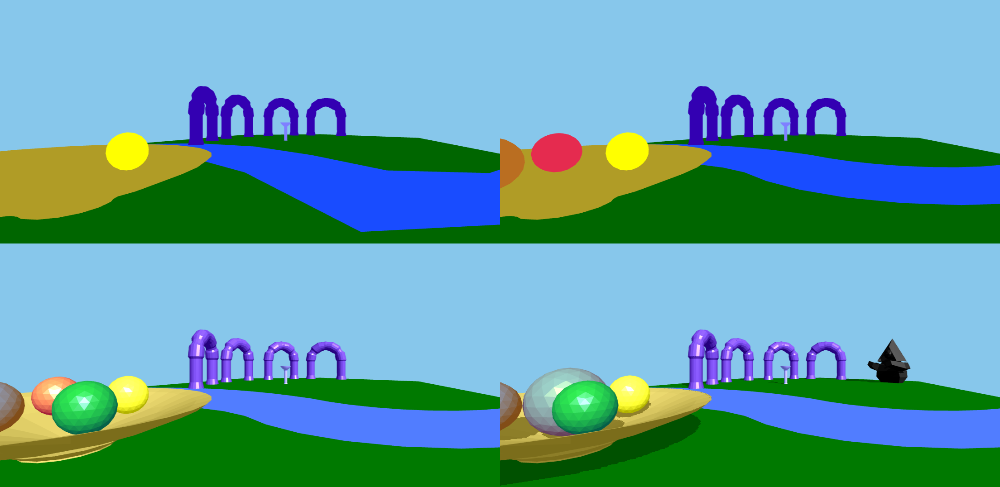

# A Game-Based Learning Approach to Teaching Interactive Computer Graphics

A majority of modern end-user applications in entertainment and productive domains utilize interactive computer graphics. Yet, the education of its underlying concepts and programming skills remain challenging to educators and students alike. The research field of game-based learning aims to exploit the favorable effects of play to motivate students and provide interactive learning environments. It thereby presents a potential solution to educational problems. This work introduces a concrete game-based approach to teaching computer graphics with an implemented extensible learning game. Overall, the application's development proved the game aspect to introduce new challenges to the development such as requiring the detailed balancing of assignment and game design. However, both the concept and final product have received majorly affirmatory sentiments from the focus group participants.

## Requirements

- Node.js to start the server

- Web browser to play the game

## Instructions
- Install dependencies:  
`npm install`

- Generate documentation:  
`bash ./generate_docs`

- Start web server:  
`npm start`

## Notes
- Physics meshes must be convex, faces must have CCW (right hand rule) winding order and coplanar faces must not exist (must be merged into one).
- Physics object's center of mass is at the origin (0, 0, 0) of meshes in object coordinates.
- Graphical mesh faces must have CCW (right hand rule) winding order (for back-face culling) and must be triangulated (coplanar faces may exist).
- Blender .ply export settings to use: Format: ASCII, Forward: -Z, Up: Y, Geometry: Normals
